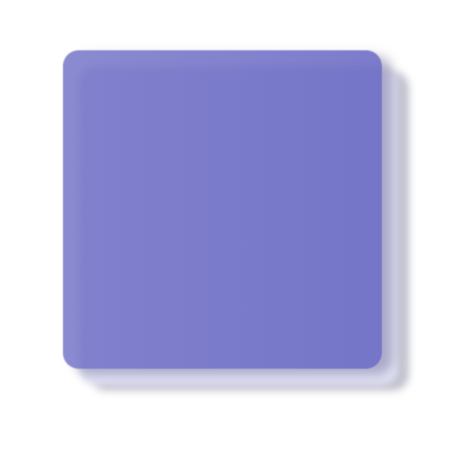

# glass_material

a simple vue component inspired by Fluent Design System

currently alpha, only following features are supported

- ugly texts
- fixed color(of course you can change if you handle all things)
- caustic with shadows(mainly worked for this one!)